# Mermaid

## install

```bash
    npm install -g @mermaid-js/mermaid-cli
    mmdc -i src.md -o dest.md
```

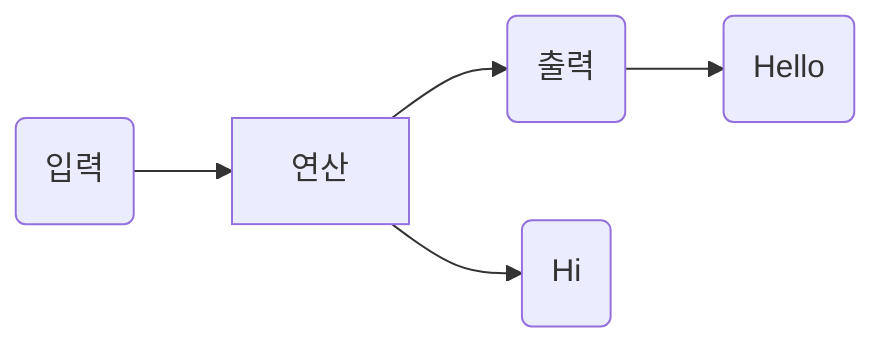

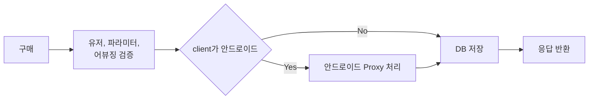

TB(= TD) : 위에서 아래로
BT : 아래에서 위로
RL : 오른쪽에서 왼쪽으로
LR : 왼쪽에서 오른쪽으로

flowchart LR
    id[구매]

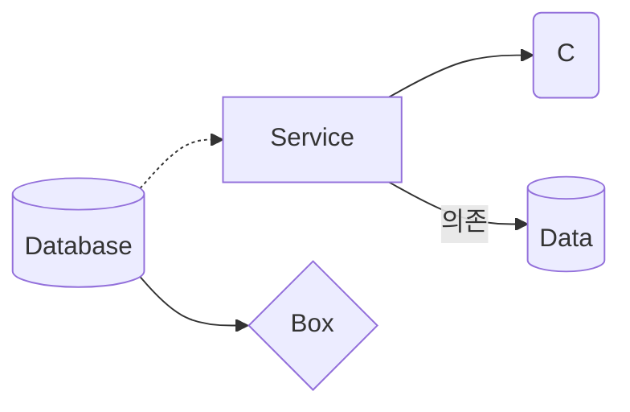

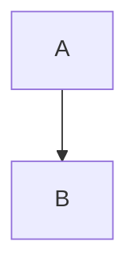

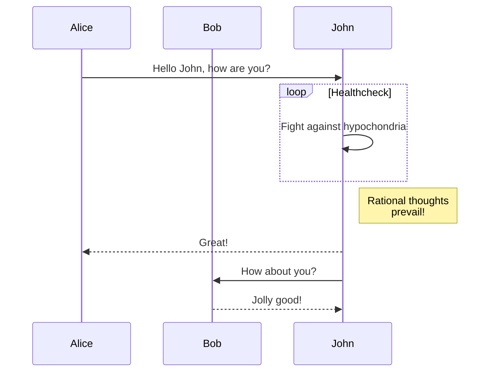

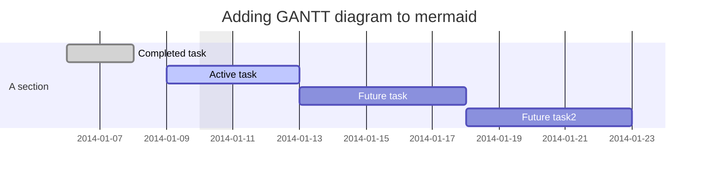

# Class diagram

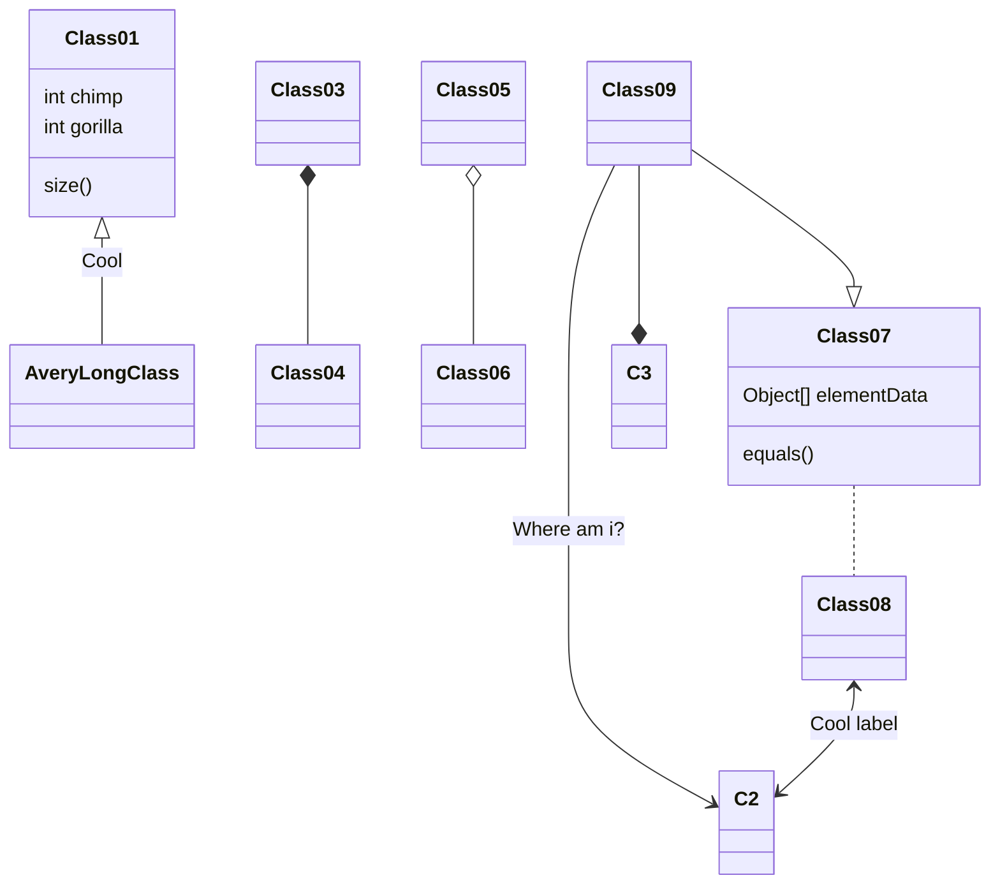

# Git graph

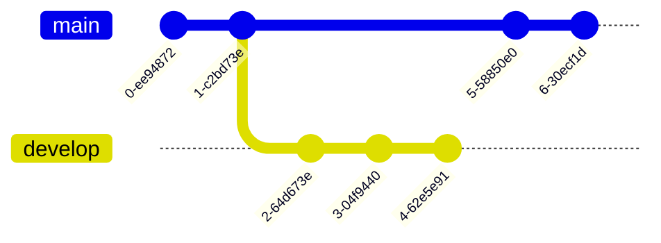

# Entity Relationship Diagram

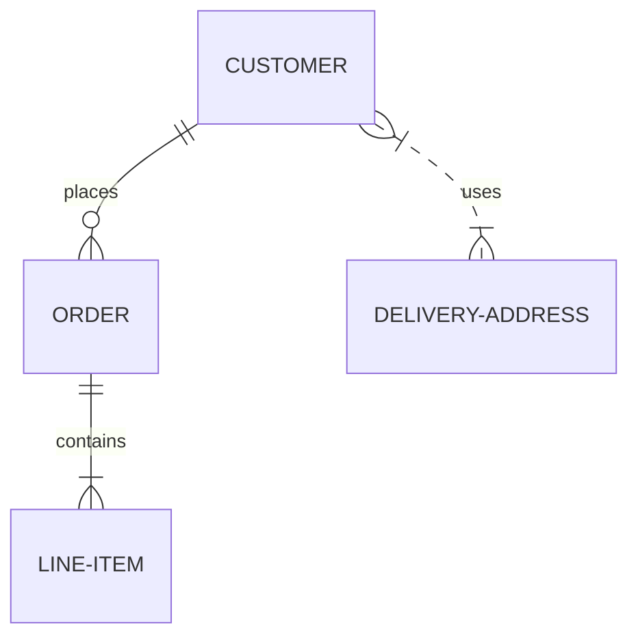

# User Journey Diagram

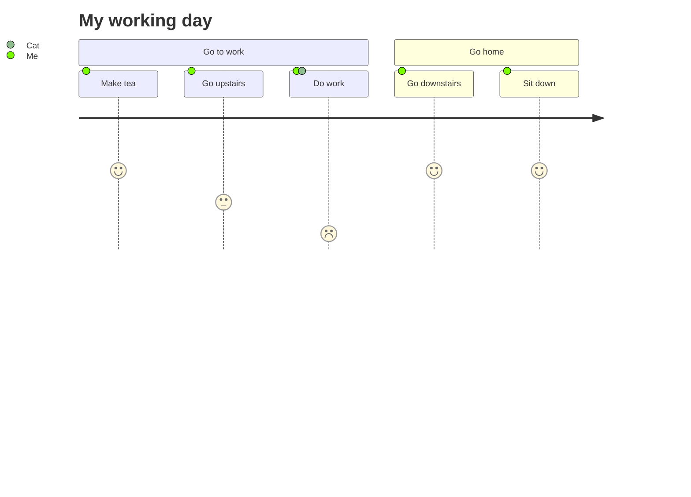

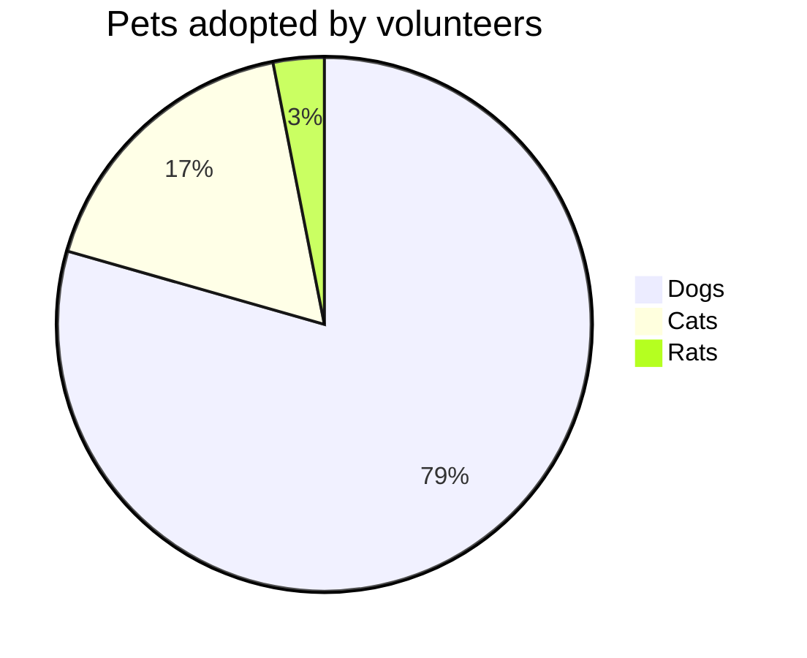

# Timeline

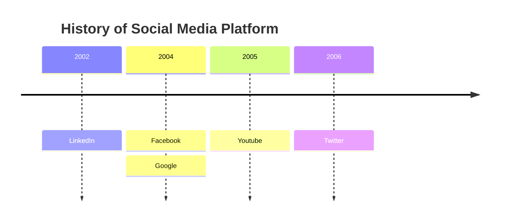

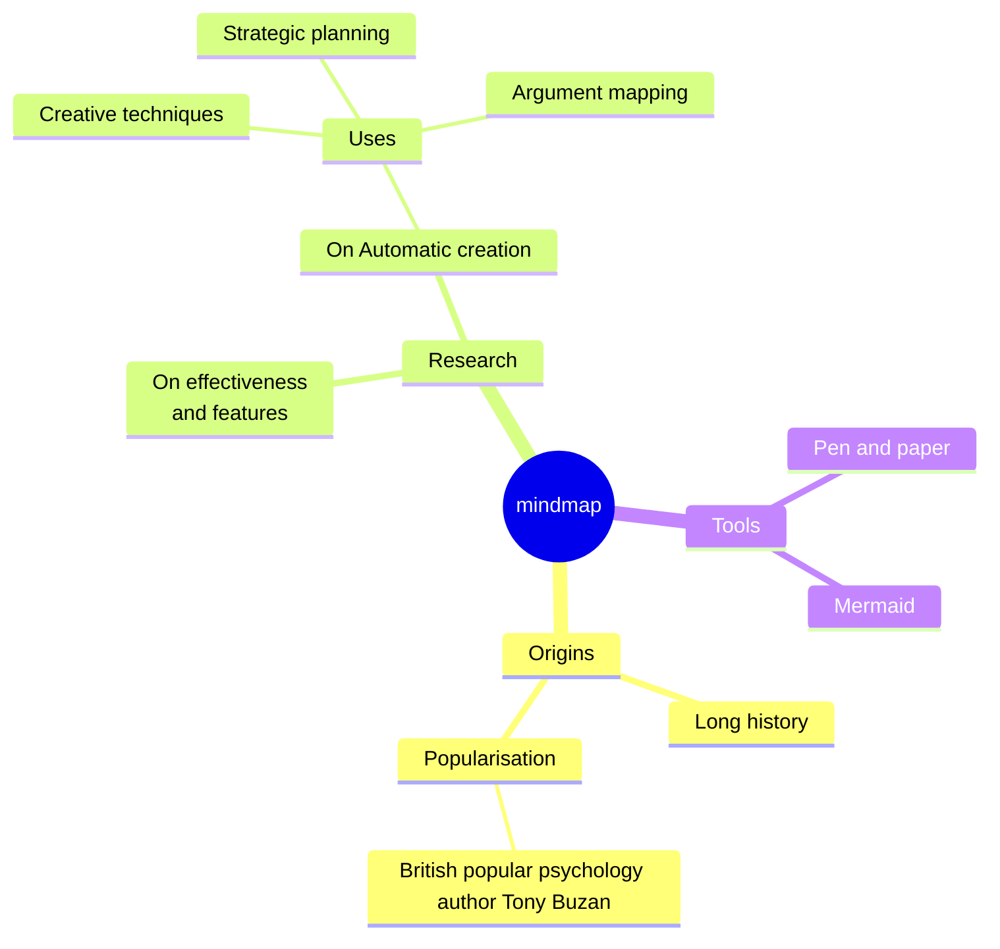
