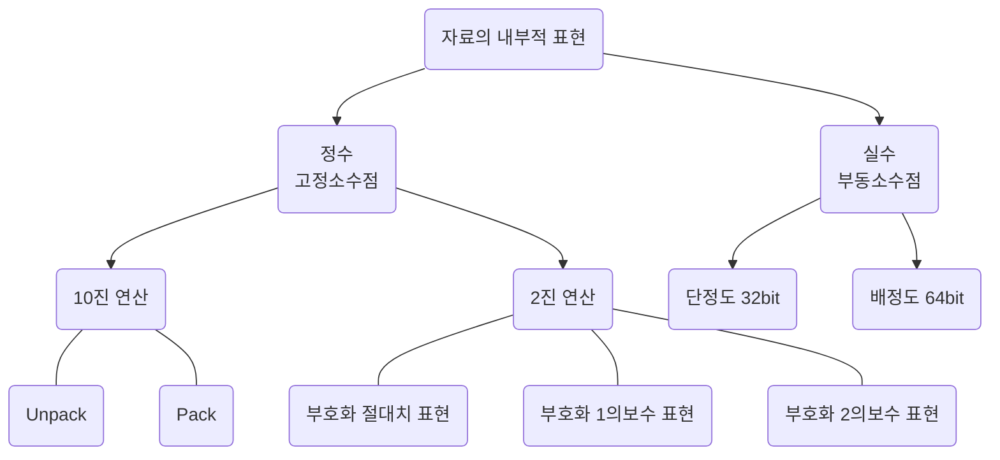

#

- 정보표현 단위
    - bit (binary digit) : `정보표현`의 최소
    - nibble : 4bit
    - byte : `문자표현`의 최소
        - 8bit
    - word : `명령처리` 단위
        - Half Word : 2byte
        - Full Word : 4byte
        - Double Word : 8byte
    - field : `파일구성`의 최소
        - 행단위 구성
    - record :
        - 논리 : 일반적인 레코드 의미
        - 물리 : block
    - file : 프로그램 구성단위
    - database

---

### 컴퓨터가 숫자를 처리하는 방식

---

- 정수
    - 고정 소수점

- 10진 연산
    - 1byte 로 1자리 표현
    - Sign : 양수 = `C`(1100), 음수 = `D`(1101)
    - Unpacked format :  |Zone|`Digit`|Zone|`Digit`|$\cdots$|Sign|Digit|
    - BCD (2진화 10진 코드) `46` $-$ 0100 0110
        - ( 4 | 6 ) $:$ 8 4 2 1 | 8 4 2 1 $-$ 0100 0110
  1. UnPack (ZONE 형식) : Zone 영역은 모두 `F`  끝에는 `기호` 표시
     1. $+1234\rightarrow{F1F2F3C4}$
     2. |Zone|Digit|Zone|Digit|Zone|Sign|Digit|
     3. |1111|0001|1111|0010|1111|0010|1100|0100|
  2. Pack :
     1. |Digit|Digit|Digit|Digit|$\cdots$|Sign|
     2. 10진수 1자리를 2진수 4자리로 표현하는 방식
  3. 고정소수점 : 10진수 전체 값을 2진수로 변환하여 표현
     1. Sign : 양수 = 0, 음수 = 1
     2. | Sign Bit |1|2|3|$\cdots$|n-1|
     3. 음수표현 방식 : $-2^7 - 1$ ($-128 \sim +127$)
        1. 10 진수 $-25_{10}\rightarrow$ $|1|0|0|1|1|0|0|1|$
        2. 부호화 절대치 : 양수 0->1
        3. 부호화 1의 보수 : 양수표현 -> 1의 보수
        4. 부호화 2의 보수 : 양수표현 -> 2의 보수

- 2진 연산
    - 부호화 절대치 표현 :
    - 부호화 1의 보수 :
    - 보호화 2의 보수 :

- 실수
    - 부동 소수점
    - | 부호 | 지수부 | 가수부 |
    - 특징
        - 매우 큰 수나 매우 작은 수를 표현할 때 사용 : `정규화` 를 통하여 표현
        - 표현의 정밀도를 높일 수 있음
        - 수 표현에 필요한 자릿수 에 있어 효율적임
        - 과학이나 공학, 수학적인 응용에 주로 사용되는 수 표현
        - 연산시간이 많이 걸림
        - 단정도 : 32비트 :
        - 배정도 : 64비트 :
    - 정규화
        - $100000000\rightarrow1\times10^8$
        - $0.0000001\rightarrow1\times10^{-7}$
    - 부동 소수점에서 음수 표현법
        - 지수는 부호에 관계없이 bias 값에 더함
        - 가수의 부호가 양수이면 $\rightarrow$ 0, 음수이면 $\rightarrow$ 1로 표현
    -

---

### 10진수 (소수 포함)를 2진수로 변환

$30.25_{10}\rightarrowtail$ 의 진법 변환 $\rightarrow11110.01_2$
- 정수부분 : `30`
    - 8421 code : $16 + 8 + 4 + 2\rightarrow$ $11110$
- 소수부분 : `.25`,
    - `0` 2를 곱하면서 정수 부분을 취함
    - $0.25\times 2\rightarrow0.5 (0)$
    - $0.5\times 2\rightarrow1.0 (1)$
    - $0.01$

#### `8 4 2 1` Code (10진수)

---

| $2^{10}$ | $2^9$ | $2^8$ | $2^7$ | $2^6$ | $2^5$ | $2^4$ | $2^3$ | $2^2$ | $2^1$ | $2^0$ |
| :------: | :---: | :---: | :---: | :---: | :---: | :---: | :---: | :---: | :---: | :---: |
|   1024   |  512  |  256  |  128  |  64   |  32   |  16   |   8   |   4   |   2   |   1   |

---

### 2진수(소수포함) 를 10진수로 변환 : `8 4 2 1` 코드 이용

$
(1101.11)_2 =
1\times(2^3) +
1\times(2^2) +
0\times(2^1) +
1\times(2^0) +
1\times2^{-1}\,(0.5)+
1\times{2}^{-2}\,(0.25)
$

- `Result` : $13.75_{10}$

---

### 보수 (Complement)

- $543_{10}$ : 10진수의 보수 구하기
    - 9의 보수 : 더해서 `999` 를 만드는 수 $\rightarrowtail$ 456
    - 10의 보수 : 더해서 `1000` 을 만드는 수 $\rightarrowtail$ 457
        - , 9의 보수에 + 1

- $1001011_2$ : 2진수의 보수 구하기
    - `1의 보수` : 더해서 `1` 을 만드는 수
        - $1001011 + (0110100) = 1111111$
    - `2의 보수` : 더해서 `0` 을 만드는 수
        - $1001011 + (0110101) = 1000000$
        - 2의 보수는 `1의 보수 + 1`

### 자료의 외부적 표현 : 문자

- ASCII (Ameriacan Standard Code for Information Interchange)
    - IBM 에서 개발, 데이터 통신 및 마이크로 컴퓨터에서 많이 채택됨
    - 7bit 코드로 128개의 문자를 표현
    - 정보교환용
- BCD (Binary Coded Decimal, 이진화 10진코드)
    - 10진수 1자리의 수를 2진수 4비트로 표현
    - 8421 코드라고도 함
    - 대표적 가중치 코드
    - 10진수 입, 출력이 간편
    - 자체 보수화는 불가능
    -
