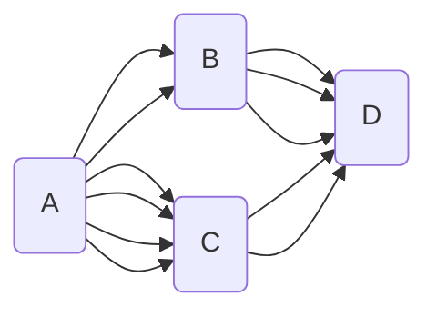

# 확률

## 경우의 수

- `합의 법칙`
    - 동시에 일어나지 않는 다수의 사건은 더함
    - 1 부터 10 까지 적힌 카드 10장 중에서 2장을 선택하는데 합이 7의 배수인 경우의 수 : `6`
        - 7 : $(1, 6) (2, 5) (3, 4)$
        - 14 : $(4, 10) (5, 9) (6, 8)$
            - 위 경우는 동시에 일어날 수 없기 때문에 합의 법칙 적용 : 3 + 3 = `6`가지 경우
    - 자연수 $x, y x + y \leq 4\qquad (x, y)$ 순서쌍의 경우의 수 : `6`
        - $2:(1, 1)$
        - $3: (1, 2)\quad(2,1)$
        - $4: (1, 3)\quad(3, 1)\quad(2, 3)$
- `곱의 법칙`
    - 동시 또는 연달아 일어나는 두 사건
    - 주사위 2개를 던질때 나올 경우의 수 (곱의 법칙적용) : `36`
        - 첫번째 : 6가지, 두번째 : 6가지
    - 동전 1개, 주사위 1개 : $2 * 6 = 12$
    - 24의 양의 약수의 갯수
        - $2^3\times3\rightarrowtail(2^0, 2^1, 2^2, 2^3) (3^0, 3^1)\quad$ 중에서 선택
        - $4\times2 = (8)$ 가지 경우의 수 발생
        - 지수에 1을 각각 더한 값을 곱하는 방법으로도 가능 $2^{3+1}\times3^{1+1}\;(4 \times 2=8)$
        - $(a+b)(x+y+z)\quad$ 항의 갯수 : $2\times3=6$

---

- ${A}\rightarrowtail{D}$ 의 경우수
    - $6(2\times3) + 6(4\times2) = 14$가지 방법

## `순열` : 순서가 있는 나열

- 서로 다른 $n$ 개에서 $r(0<r\leq{n})$ 개를 순서있게(1,2) or (2,1) 택하여
- 일렬로 나열하는 것을 n개에서 r개를 택하는 `순열`이라 하고
- $_nP_r$ (서로다른 `n`개중에 `r`개를 일렬로 나열할 때)
    - 첫번째 자리에 올 수 있는 것은 $n$ 가지
    - 두번째 자리에 올 수 있는 것은, 첫번째 자리에 놓인 것을 제외한 $(n-1)$
    - 세번째 자리에 올 수 있는 것은, 첫번째 자리에 놓인 것을 제외한 $(n-2)$
    - $\vdots$
    - $r$ 번째 자리에 올 수 있는 것은, 앞의 $(r-1)$ 자리에 놓인 것을  제외한
    - $n\times(r-1)\times\dots\times(n-r+1)$ 까지의 곱하기.
    - $_{10}P{_5} = 10\cdot9\cdot8\cdot7\cdot6\;(5ea)$
- `계승` $\rightarrowtail{n!} (factorial,$ 팩토리얼)이라고 읽음
- 이것은 $_nP_n = n!$
- (약속) $0! = 1\quad{_n}P{_0} = 1$
- ${n!}=n(n-1)n-2)\cdot\dots\cdot3\cdot2\cdot1$
-
- P 는 Permutation(퍼뮤테이션, 순열)의 첫 글자를 기호화 한 것
- `1, 2, 3` 번호가 적힌 `3장`의 카드 중에서 서로 다른 `2장`의 카드를 택하여 만들 수 있는 두자리 자연수의 갯수
    - 십의 자리에는 1, 2, 3 장의 카드가 올 수 있고
    - 그 각각에 대하여 일의 자리에 올 수 있는 숫자는 십의 자리에 택한 카드를 제외한 2장의 카드 중 하나
    - 따라서 구하는 자연수의 갯수는 곱의 곱칙에 의하여
    - $3\times2=(6)$ 개의 경우 (기호) $\rightarrowtail\;{_3}P_2$
- $e.g.$ __이웃해야 하는 순열__
    - $(A,B),C,D,E$
        - $4! \times 2! = 24 \times 2 = (48)$ 가지 경우
    - $(A,B,C),D,E$
        - $3!\times3! = (36)$ 가지 경우
    - $(A,B),(C,D),(E,F)$
        - $3!\times2!\times2!\times2! = (48)$
- $e.g.$ __이웃하면 안되는 순열__
    - $[A,B],C,D,E$ 단, A, B는 이웃하면 안됨
        - 이웃해도 되는 것을 먼저 나열 : $C,D,E = 3!$
        - 사이사이 및 양쪽 끝에 이웃하면 안되는 것을 끼워 넣는다.
            - $[1]D[2]C[3]E[4]$ 에서 숫자 부분에 순서있게 A, B 를 넣는다.
            - $_4P_2=\frac{4!}{(4-2)!} = (12)$
