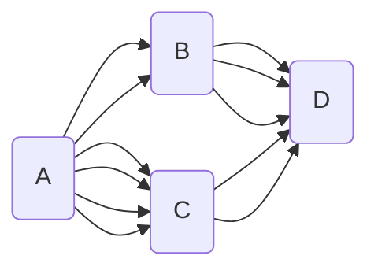

# 확률

## 경우의 수

- `합의 법칙`
  - 동시에 일어나지 않는 다수의 사건은 더함
  - 1 부터 10 까지 적힌 카드 10장 중에서 2장을 선택하는데 합이 7의 배수인 경우의 수 : `6`
    - 7 : $(1, 6) (2, 5) (3, 4)$
    - 14 : $(4, 10) (5, 9) (6, 8)$
      - 위 경우는 동시에 일어날 수 없기 때문에 합의 법칙 적용 : 3 + 3 = `6`가지 경우
  - 자연수 $x, y x + y \leq 4\qquad (x, y)$ 순서쌍의 경우의 수 : `6`
    - $2:(1, 1)$
    - $3: (1, 2)\quad(2,1)$
    - $4: (1, 3)\quad(3, 1)\quad(2, 3)$
- `곱의 법칙` 
  - 동시 또는 연달아 일어나는 두 사건
  - 주사위 2개를 던질때 나올 경우의 수 (곱의 법칙적용) : `36`
    - 첫번째 : 6가지, 두번째 : 6가지
  - 동전 1개, 주사위 1개 : $2 * 6 = 12$
  - 24의 양의 약수의 갯수
    - $2^3\times3\rightarrowtail(2^0, 2^1, 2^2, 2^3) (3^0, 3^1)\quad$ 중에서 선택
    - $4\times2 = (8)$ 가지 경우의 수 발생
    - 지수에 1을 각각 더한 값을 곱하는 방법으로도 가능 $2^{3+1}\times3^{1+1}\;(4 \times 2=8)$
    - $(a+b)(x+y+z)\quad$ 항의 갯수 : $2\times3=6$

---

- ${A}\rightarrowtail{D}$ 의 경우수
  -  $6(2\times3) + 6(4\times2) = 14$가지 방법

## `순열` : 순서가 있는 나열

- 이웃해야 하는 순열
  - $(A,B),C,D,E$
    - $4! \times 2! = 24 \times 2 = (48)$ 가지 경우
  - $(A,B,C),D,E$
    - $3!\times3! = (36)$ 가지 경우
  - $(A,B),(C,D),(E,F)$
    - $3!\times2!\times2!\times2! = (48)$
- 이웃하면 안되는 순열
  - $[A,B],C,D,E$ 단, A, B는 이웃하면 안됨
    - 이웃해도 되는 것을 먼저 나열 : $C,D,E = 3!$
    - 사이사이 및 양쪽 끝에 이웃하면 안되는 것을 끼워 넣는다.
      - $[1]D[2]C[3]E[4]$ 에서 숫자 부분에 순서있게 A, B 를 넣는다.
      - $4P2=\frac{4!}{(4-2)!} = (12)$
